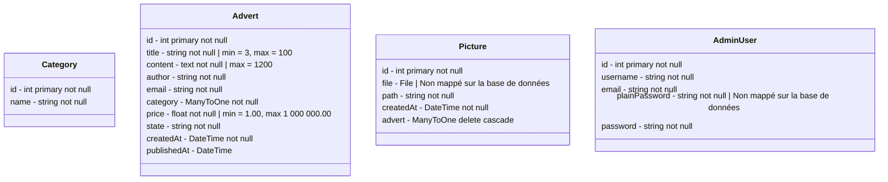

# LEBONANGLE

Le site LEBONANGLE permet de déposer et de consulter des annonces sur un environnement mobile. Il est construit avec un
admin Symfony et une API exposée via Api Platform.

## Installation

- [x] Le projet doit être créé à l'aide du binaire Symfony en utilisant la version full du framework :

```shell
scoop install symfony-cli
symfony new projet-symfony-antoine-mattei --webapp # L'option '--webapp' installe tous les paquets nécessaires à la création d'une application web. L'installation sera plus lourde.
cd projet-symfony-antoine-mattei
symfony console about
symfony server:ca:install
symfony serve -d # L'option 'd' permet de lancer le processus en arrière plan.
symfony server:stop
```

## Entités

Le projet contient les entités suivantes :

(Pour voir les diagrammes sous IDE JetBrains, aller dans `Settings` | `Languages & Frameworks` | `Markdown`
| `Markdown Extensions` | `Mermaid`)



## Encodage des mots de passe

- [X] Lorsqu'un admin est créé ou modifié, si son plainPassword (mot de passe en clair) est renseigné, il doit être encodé et
sauvé dans password grace
à [un listener (ou subscriber) doctrine](https://symfony.com/doc/current/security.html#c-encoding-passwords).

## Renseignement de la date de création

- [x] Lorsqu'une annonce est créée, sa date de création est automatiquement renseignée.
- [ ] Il en est de même pour les images.

## Workflow des annonces

- [x] Les annonces sont rattachées à un workflow. Lorsqu'elles sont créées, elles sont dans le statut `draft`. Les admins
peuvent les publier (status `published` ) ou les rejeter (status `rejected`). Une fois publiées, elles peuvent toujours
être rejetées.

- [x] Quand une annonce passe du status `draft` à `published`, sa date de publication est automatiquement renseignée

- [ ] Quand une annonce passe du status `draft` à `published`, un mail de notification est envoyé à l'utilisateur qui l'a créée.

## Admin

- [x] Vous devez créer un admin sous Symfony. Il n'est pas possible d'utiliser un bundle d'admin (type EasyAdminBundle).

- [x] L'admin est accessible uniquement aux utilisateurs de type AdminUser qui s'authentifient grâce à un formulaire de
connexion.

### Crud AdminUser

- [x] Les admins peuvent lister, ajouter, mettre à jour et supprimer un utilisateur.

- [x] Lors de la création ou de la mise à jour, le champ `password` n'est pas accessible, mais le champ `plainPassword` l'est.

- [x] Un admin ne peut pas supprimer son propre compte.

- [ ] Il doit forcément rester un admin.

### Crud Category

- [x] Les admins peuvent lister, ajouter, mettre à jour et supprimer une catégorie.

- [x] Si une catégorie est rattachée à au moins une annonce, elle ne peut pas être supprimée. 

- [x] La liste des catégories est paginée 30 par 30.

### Gestion des annonces

- [x] Les admins peuvent lister, consulter, publier ou rejeter une annonce.

- [x] Les annonces ne peuvent pas être créées, modifiées ou supprimées depuis l'admin.

- [ ] Dans la liste, on doit connaitre le nombre de photos rattachées à l'annonce et dans la consultation, toutes les photos
sont visibles.

- [x] La liste des annonces est paginée 30 par 30.

## API

- [ ] Une API permet de récupérer et de créer des informations. Elle est basée sur le bundle Api Bundle

### Category

- [ ] On peut récupérer la liste des catégories ainsi qu'accéder à une seule catégorie

### Advert

- [ ] On peut créer / lister / accéder au détail des annonces.

- [ ] Les annonces peuvent être triées par date de publication ou par prix (`ASC` et `DESC`).

- [ ] Les annonces peuvent être filtrées par catégorie ainsi que par prix (entre `min` et `max`)

### Picture

- [ ] On peut créer / lister / accéder au détail des images. Les images sont créées via l'API avant les annonces (en envoyant
le fichier) et l'annonce reçoit la liste des images téléchargées lors de la création (c'est à ce moment-là que le lien
est fait entre annonce et image en base de données).

## Notification

- [ ] Lorsqu'une annonce est créée, une notification par mail est envoyée à tous les AdminUser.

- [ ] La notification contient 3 boutons : un permettant d'envoyer sur la fiche de consultation dans l'admin, un second
permettant de publier l'annonce et un troisième de rejeter l'annonce.

## Test

- [ ] L'API doit être intégralement testée. Vous pouvez voir comment tester une API dans
la [documentation d'API platform](https://api-platform.com/docs/core/testing/).

## L'accès mobile

- [ ] L'API sera consommé par une interface mobile utilisant la technologie de votre choix à partir du moment où elle a été
étudiée en cours.

- [ ] Elle permet de lister et de filtrer les annonces publiées comme décrit dans la partie API des annonces.

- [ ] Elle offre également la possibilité de créer une annonce et les images rattachées.

- [ ] La création d'une annonce se fait sans compte utilisateur. Elles ne peuvent pas être modifiées.

## Commandes (bonus)

Vous devez créer les commandes symfony suivantes :

- [ ] Une commande permettant de supprimer toutes les annonces rejetées, créées il y a X jours (X étant un argument de la
commande)
- [ ] Une commande permettant de supprimer toutes les annonces publiées il y a X jours (X étant un argument de la commande).
Ne pas se fier à la date de création mais bien à celle de publication.
- [ ] Une commande permettant de supprimer toutes les images non rattachées à une annonce créées il y a plus de X jours (X
étant un argument de la commande)